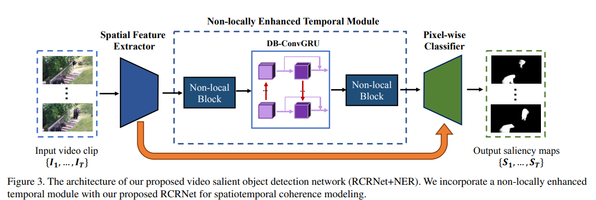

## Training Instruction

### Training RCRNet+NER
If you want to train the proposed RCRNet from scratch, please refer to our paper and the following instruction carefully.

The proposed RCRNet is built upon an ResNet-50 pretrained on ImageNet.


**First**, we use two image saliency datasets, i.e., [MSRA-B](https://mmcheng.net/msra10k/) and [HKU-IS](https://i.cs.hku.hk/~gbli/deep_saliency.html), to pretrain the RCRNet (Figure 2), which contains a spatial feature extractor and a pixel-wise classifer. Here, we provide the weights of RCRNet pretrained on image saliency datasets at at [Google Drive](https://drive.google.com/open?id=1S7nao9WEhIiTmTC-E0nujMxm5Emypti9) or [Baidu Pan](https://pan.baidu.com/s/196cUbTInWJKd8FmiP9Jv_A) (passwd: j839). For simplicity, we do not provide the training code of this step. If you want to train this step you can implement your own training code.



**Second**, we use the RCRNet pretrained on image saliency datasets as the backbone. Then we combine the training set of three video saliency datasets including VOS, DAVIS, and FBMS, to train the full video model, i.e., RCRNet equipped with NER module (Figure 3). You can run the following commands to train the RCRNet+NER.
```
$ CUDA_VISIBLE_DEVICES=0 python train.py \
                            --data data/datasets \
                            --checkpoint models/image_pretrained_model.pth
```

### Using psedo-labels for training


As for the second step, if you want train the RCRNet+NER using generated pseudo-labels for joint supervision. You can use our proposed flow-guied pseudo-label generator (FGPLG, Figure 4) to generate the pesdu-labels with a part of ground truth images.

Note that the FGPLG requires flownet2.0 for flow estimation. Thus, please install the pytorch implementation of flownet2.0 using the following commands.
```
# Install FlowNet 2.0 (implemented by NVIDIA)
$ cd flownet2
$ bash install.sh
```

#### Generating pseudo-labels using FGPLG
We provide the weights of FGPLG which is trained under the supervision of 20% ground truth images at [Baidu Pan](https://pan.baidu.com/s/1dw8O2Ua5pKmOKYVgKRyADQ) (passwd: hbsu). You can generate the pseduo-labels by
```
$ CUDA_VISIBLE_DEVICES=0 python generate_pseudo_labels.py \
                            --data                    data/datasets \
                            --checkpoint              models/pseudo_label_generator_5.pth \
                            --pseudo-label-folder     data/pseudo-labels \
                            --label_interval          5 \
                            --frame_between_label_num 1
```

Then you can train the video model under the joint supervision of pseudo-labels.
```
$ CUDA_VISIBLE_DEVICES=0 python train.py \
                            --data                data/datasets \
                            --checkpoint          models/image_pretrained_model.pth \
                            --pseudo-label-folder data/pseudo-labels/1_5
```

#### (Optional) Training FGPLG
You can also train the FGPLG using other propotions of ground truth images by

(Note that need to download the pretrained model of [Flownet2](https://github.com/NVIDIA/flownet2-pytorch#converted-caffe-pre-trained-models))
```
# set l
$ CUDA_VISIBLE_DEVICES=0 python train_fgplg.py \
                            --data               data/datasets \
                            --label_interval     l \
                            --checkpoint         models/image_pretrained_model.pth \
                            --flownet-checkpoint models/FlowNet2_checkpoint.pth.tar
```

Then you can use the trained FGPLG to generate pseudo labels based different numbers of GT images.
```
# set l and m
$ CUDA_VISIBLE_DEVICES=0 python generate_pseudo_labels.py \
                            --data                    data/datasets \
                            --checkpoint              models/pseudo_label_generator_m.pth \
                            --label_interval          l \
                            --frame_between_label_num m \
                            --pseudo-label-folder     data/pseudo-labels
```
Finally, you can train the video model under the joint supervision of pseudo-labels.
```
# set l and m
$ CUDA_VISIBLE_DEVICES=0 python train.py \
                            --data                data/datasets \
                            --checkpoint          models/image_pretrained_model.pth \
                            --pseudo-label-folder data/pseudo-labels/m_l
```
